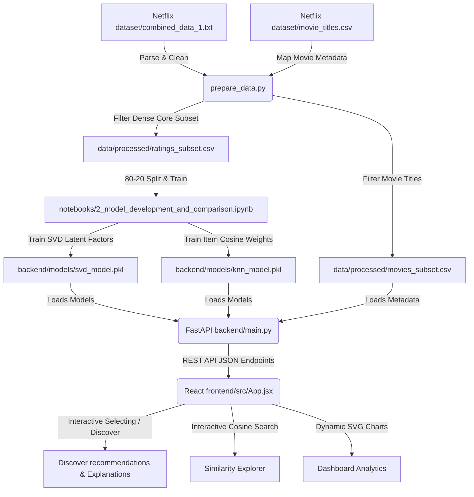

# FlixPulse - Netflix Movie Recommendation & Analytics Dashboard

FlixPulse is an end-to-end movie recommendation system and interactive dashboard. Built using a dense, high-quality subset of the **Netflix Prize Dataset**, it demonstrates how matrix factorization and collaborative filtering can power real-time, explainable recommendations.

This project meets both the mandatory requirements and several optional components of the **Cult Open Projects 2026 AI/ML Challenge**.

---

## System Architecture & Data Flow



---

## Features

1. **Exploratory Data Analysis (EDA)**: Jupyter Notebook highlighting rating distribution, sparsity, user activity patterns, and content popularity trends.
2. **Model Comparison**: Side-by-side comparison of:
   - **Singular Value Decomposition (SVD)** (latent factor model optimizing rating prediction / RMSE).
   - **Item-Based Collaborative Filtering (KNN)** (neighborhood-based model using Cosine Similarity).
3. **Advanced Metrics**: Evaluation using **RMSE**, **MAE**, **MAP@10**, **NDCG@10**, **Hit Rate**, **Coverage**, and **Diversity** (Intra-List Diversity).
4. **Explainable AI Framework**: Explains each recommendation based on item-to-item similarity metrics (e.g. *"Because you gave 'Toy Story' a 5 (98% similarity)"*).
5. **Cold Start Strategy**: Implements fallback mechanisms for new users (popularity-based) and handles sparse histories.
6. **Full-Stack Web App & Interactive Dashboard**:
   - **Backend**: FastAPI REST server providing fast, cache-enabled endpoints.
   - **Frontend**: React (Vite) Single Page Application styled with a premium dark-themed glassmorphism aesthetic, featuring custom SVG data visualizations.

---

## Repository Structure

```
cult/
├── data/                       # Dataset directory
│   └── processed/              # Filtered subsets and similarity matrices
├── notebooks/                  # Jupyter Notebooks for AI/ML pipeline
│   ├── 1_exploratory_data_analysis.ipynb
│   ├── 2_model_development_and_comparison.ipynb
│   └── 3_recommendation_and_explainability.ipynb
├── backend/                    # FastAPI Server
│   ├── main.py                 # API endpoints & server setup
│   ├── recommender.py          # Recommendations & explanations module
│   ├── requirements.txt        # Backend dependencies
│   └── models/                 # Serialized model binaries (.pkl)
├── frontend/                   # React + Vite Dashboard
│   ├── src/
│   │   ├── App.jsx             # React frontend UI logic & dynamic SVG charts
│   │   ├── App.css             # Component-specific styles
│   │   ├── index.css           # Global design system & theme tokens
│   │   └── main.jsx
│   ├── package.json
│   └── vite.config.js
├── scripts/                    # Helper scripts
│   └── prepare_data.py         # Subsetting and parsing script
├── technical_report.tex        # LaTeX Technical Report (Deliverable 1)
├── presentation.tex            # LaTeX Slide Presentation (Deliverable 3)
└── README.md                   # Setup and execution guide
```

---

## Installation & Setup

### Prerequisites
- Python 3.10+
- Node.js & npm
- A copy of the Netflix Prize Dataset placed in `dataset/` (the raw directory must contain `combined_data_1.txt` and `movie_titles.csv`).

### 1. Data Preparation & Model Training
First, set up a virtual environment and install the Python dependencies:

```bash
# Install root/backend requirements
pip install -r backend/requirements.txt
pip install jupyter nbformat
```

Prepare the data subset:
```bash
python scripts/prepare_data.py
```
This extracts a dense subset containing **21,045 active users**, **1,287 movies**, and **5,702,695 reviews** from `combined_data_1.txt` and saves them in `data/processed/`.

Execute the Jupyter Notebooks to generate data plots and train the SVD and KNN models:
```bash
# Run Notebook 1: EDA
jupyter nbconvert --to notebook --execute --inplace notebooks/1_exploratory_data_analysis.ipynb

# Run Notebook 2: Model Development, Comparison, and Serialization
jupyter nbconvert --to notebook --execute --inplace notebooks/2_model_development_and_comparison.ipynb

# Run Notebook 3: Recommendation, Explainability, and Cold Start Strategy
jupyter nbconvert --to notebook --execute --inplace notebooks/3_recommendation_and_explainability.ipynb
```
*The model binaries are automatically saved directly into the `backend/models/` folder.*

---

### 2. Start the Backend API Server
Navigate to the backend directory and launch the server using Uvicorn:

```bash
cd backend
python main.py
```
The server will start at `http://127.0.0.1:8000`. You can inspect and test the interactive API docs at `http://127.0.0.1:8000/docs`.

---

### 3. Start the Frontend Dashboard
Open a new terminal window, navigate to the frontend folder, install the npm modules, and run the Vite dev server:

```bash
cd frontend
npm install
npm run dev
```
Open your browser and navigate to the URL provided in the console (typically `http://localhost:5173`).

---

## Model Evaluation Summary

| Metric | Matrix Factorization (SVD) | Item-Based (KNN) | Technical Insight \& Trade-off |
| :--- | :---: | :---: | :--- |
| **Test RMSE** (Lower is better) | **0.8160** | 0.8553 | SVD captures fine-grained latent features, achieving superior rating accuracy. |
| **Test MAE** (Lower is better) | **0.6368** | 0.6687 | Average rating predictions deviate by only 0.63 stars using SVD. |
| **MAP@10** (Higher is better) | **0.7427** | 0.7079 | SVD achieves 74.2\% mean precision over top recommendation ranks. |
| **NDCG@10** (Higher is Better) | **0.8337** | 0.8081 | Evaluates position relevance; SVD is highly effective at top sorting placement. |
| **Precision@10** | **0.8051** | 0.7814 | Out of 10 recommendations, ~8 are relevant to the user profile. |
| **Recall@10** | **0.3388** | 0.3272 | SVD retrieves over 33.8\% of total relevant items for the user. |
| **Hit Rate@10** | **99.94\%** | 99.92\% | Almost all test users receive at least 1 relevant recommended item. |
| **User Coverage** | **99.96\%** | 99.96\% | The model successfully predicts items for nearly the entire user space. |
| **Intra-List Diversity** | **0.0477** | 0.0452 | SVD list diversity is cohesive but slightly wider than item-based KNN. |
| **Training Time** | **8.92s** | 225.86s | SVD updates latent weights linearly in SGD; KNN scales quadratically. |

We resolve this trade-off in FlixPulse by using **SVD** for the core recommendation generation (best scores/accuracy) and caching the **KNN** similarity weights to generate explanation text.
